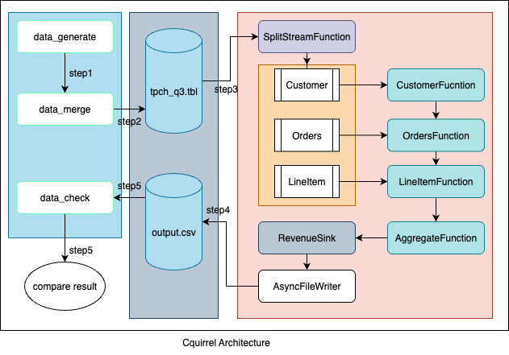
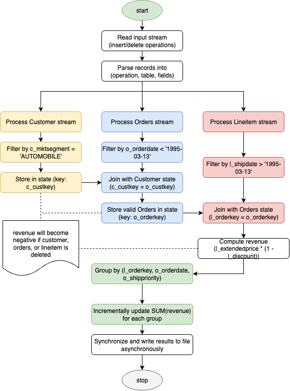
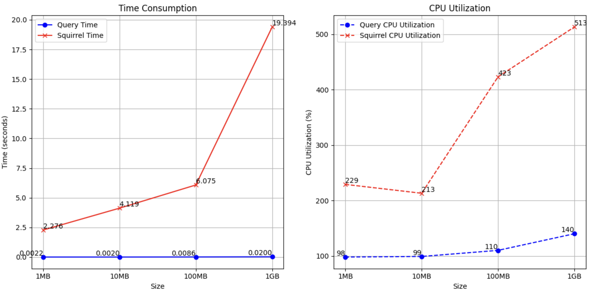
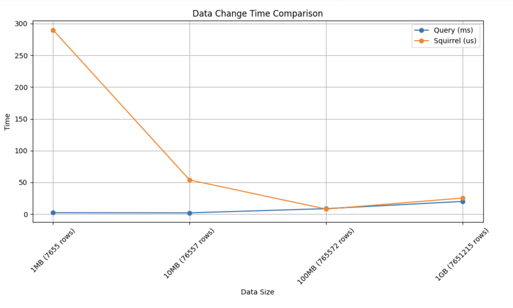

# Real-time Processing of TPC-H Query 3 via Cquirrel-UST-Enhanced Flink
The code repo is for HKUST Individual project: Cquirrel

# 1. The Program Architecture

# 2. The Query Workflow Diagram

# 3. Results

## 3.1 Statistics of full table join queries

## 3.2 Statistics of a single data update query

* Cquirrel is **faster** than db query.

# 4. How to run this program
1. Read the readme files in both Core and Script directories and run the commands, OR
2. Run the `bash run.sh` directly to observe the result.

# Kindly reminder
If you cannot execute the program or script correctly, please check whether your python, maven and JDK version are correct and your python packages or java dependencies are complete.